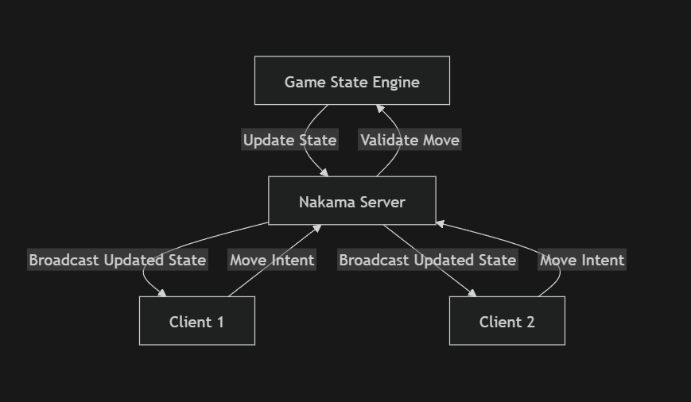
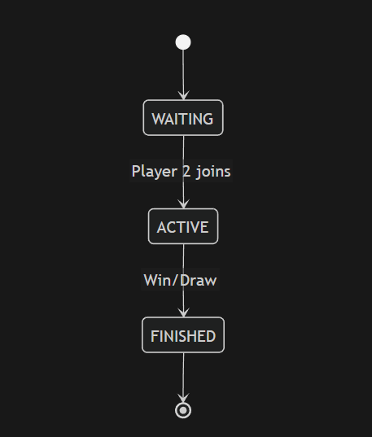
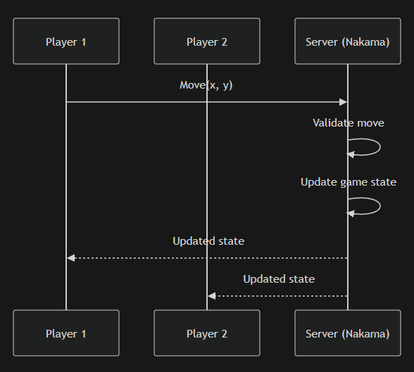
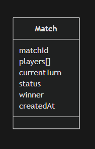
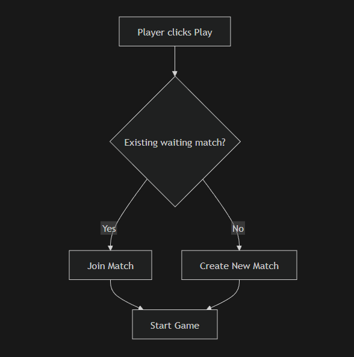

# System Design Overview

The system is built using a **server-authoritative architecture** where all game logic and state transitions are handled on the server using Nakama. Clients act as thin interfaces that send player intents and render validated game state.

This approach ensures:
- Strong consistency across clients
- Prevention of client-side cheating
- Centralized validation and control of game rules

---

# Architecture

### Design Explanation

- Clients do not directly modify game state
- All player actions are sent as **intents** to the server
- The Nakama server:
  - Validates incoming actions
  - Updates the authoritative game state
  - Broadcasts updated state to all connected players

This ensures that all players always operate on a **single source of truth**.

---

# Match Lifecycle

### States

- **WAITING**
  - Match created, waiting for second player
- **ACTIVE**
  - Both players connected, game in progress
- **FINISHED**
  - Game completed (win/draw/forfeit)

### Transitions

- WAITING → ACTIVE  
  Triggered when second player joins

- ACTIVE → FINISHED  
  Triggered when:
  - A player wins
  - Game results in a draw
  - A player disconnects or forfeits

---

# Game Flow

### Flow Description

1. Player sends a move intent `(x, y)` to the server
2. Server validates:
   - Player is part of the match
   - It is the player's turn
   - Target cell is empty
   - Match is in ACTIVE state
3. If valid:
   - Game state is updated
   - Win/draw condition is evaluated
   - Turn is switched
4. Updated state is broadcast to both players

Invalid moves are rejected without affecting the game state.

---

# Game State Model

### State Representation

Each match maintains an isolated state object:

- `matchId`: Unique identifier
- `players`: List of player IDs
- `currentTurn`: Player ID whose turn it is
- `status`: WAITING | ACTIVE | FINISHED
- `winner`: Player ID (if any)
- `createdAt`: Timestamp

### Design Considerations

- State is **fully owned and mutated only by the server**
- No shared state between matches (ensures isolation)
- Enables safe concurrent execution of multiple matches

---

# Matchmaking

### Approach

A simple matchmaking strategy is used:

- Player requests a match via "Play"
- System:
  - Searches for an existing WAITING match
  - If found → joins match
  - Else → creates a new match

---

# Validation & Game Integrity

All validation is performed server-side to ensure fairness and consistency.

### Move Validation Rules

- Match must be in ACTIVE state
- Player must belong to the match
- Move must be made in turn order
- Target cell must be empty

---

# Failure Handling

### Player Disconnect

- If a player disconnects during an ACTIVE match:
  - A grace period is allowed for reconnection (30 secs)
  - If not reconnected → match is marked as FINISHED
  - Opponent is declared winner (forfeit)

### Invalid Messages

- Silently rejected and logged
- Show "Something went wrong" to user
- Reset to current state in user side
- No impact on match state

### Concurrent Moves

- Turn-based validation prevents race conditions

---

# Concurrency & Scalability

### Match Isolation

- Each match runs as an independent state container
- No shared mutable state between matches

### Concurrency Model

- Multiple matches can run simultaneously
- Each match processes its own event stream

---

# Extensibility

The system is designed to support additional features with minimal changes:

### Timer-Based Mode
- Per-turn timeout tracking
- Automatic forfeit on timeout

### Leaderboard System
- Persistent tracking of wins/losses
- Ranking based on performance

---

# Summary

This design ensures:
- Strong server authority and consistency
- Clear separation of concerns
- Scalable and concurrent match handling
- Robust validation and failure handling